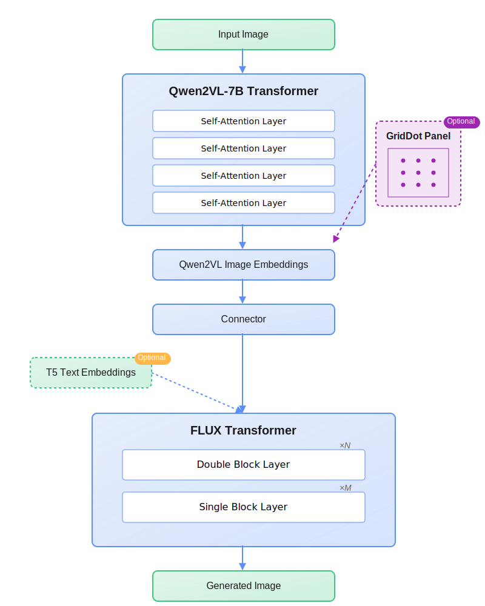

# Qwen2VL-Flux: Unifying Image and Text Guidance for Controllable Image Generation

This repository contains a powerful image generation model that combines the capabilities of Stable Diffusion with multimodal understanding. The model can generate, modify, and transform images using both text and image inputs.

This implementation uses Qwen2VL as the vision-language model for enhanced multimodal understanding, integrated with the Flux architecture. It also supports ControlNet features including depth estimation and line detection for more precise image generation control.

For technical details, please refer to our [technical report](technical-report.pdf).

## Model Architecture

The Flux model enhances Stable Diffusion by replacing the traditional text encoder with a vision-language model (Qwen2VL), enabling superior multimodal understanding and generation:



Key architectural features:
- Vision-Language Understanding: Utilizes Qwen2VL for superior image and text comprehension
- Enhanced Control: Integrates ControlNet for precise structural guidance
- Flexible Pipeline: Supports various generation modes including variation, img2img, and inpainting

## Features

- **Multiple Generation Modes**:
  - `variation`: Generate variations of input images
  - `img2img`: Transform images based on reference images
  - `inpaint`: Intelligent image inpainting with masks
  - `controlnet`: Precise image generation with structural guidance
  - `controlnet-inpaint`: Combine ControlNet guidance with inpainting

- **Multimodal Understanding**: 
  - Advanced text-to-image capabilities
  - Image-to-image transformation
  - Visual reference understanding

- **ControlNet Integration**:
  - Line detection guidance
  - Depth-aware generation
  - Adjustable control strengths

- **Advanced Features**:
  - Attention mechanism for focused generation
  - Customizable aspect ratios
  - Batch image generation
  - Turbo mode for faster inference

## Requirements

- Python 3.8 or higher
- CUDA compatible GPU (recommended)
- PyTorch 2.4.1 or higher
- 48GB+ GPU memory

### Environment Setup

The model requires the following main dependencies:
- PyTorch >= 2.4.1
- Transformers 4.45.0
- Diffusers 0.30.0
- Accelerate 0.33.0

For a complete list of dependencies, see `requirements.txt`.

## Installation

1. Clone this repository:
```bash
git clone https://github.com/yourusername/flux-model.git
cd flux-model
```

2. Create a virtual environment (recommended):
```bash
python -m venv venv
source venv/bin/activate  # Linux/Mac
# or
venv\Scripts\activate  # Windows
```

3. Install dependencies:
```bash
pip install -r requirements.txt
```

4. Download model checkpoints:

The model requires several checkpoint files to run. Please follow these steps:

a) Main model files:
- Download the Qwen2VL-Flux model files from [Hugging Face](https://huggingface.co/Djrango/Qwen2vl-Flux)
- Place them in the `checkpoints` directory with the following structure:
  ```
  checkpoints/
  ├── flux/              # Main Flux model files
  ├── qwen2-vl/          # Qwen2VL model files
  ```

b) For ControlNet features (optional):
- depth-anything-v2
- mistoline
- segment-anything-v2

5. Configure model paths:

Modify the following paths in `model.py` to match your setup:
```python
FLUX_MODEL_PATH = "/checkpoints/flux"
CONTROLNET_MODEL_PATH = "/checkpoints/controlnet"
QWEN2VL_MODEL_PATH = "/checkpoints/qwen2-vl"
DEPTHANYTHING_MODEL_PATH = "/checkpoints/depth-anything-v2"
MISTOLINE_MODEL_PATH = "/checkpoints/anyline"
SAM2_MODEL_PATH = "/checkpoints/segment-anything-v2"
```

## Usage

### Basic Command Structure

```bash
python main.py --mode <mode> --input_image <path> [additional options]
```

### Common Options

- `--mode`: Generation mode (`variation`/`img2img`/`inpaint`/`controlnet`/`controlnet-inpaint`)
- `--input_image`: Path to the input image
- `--prompt`: Text prompt to guide generation
- `--output_dir`: Directory for saving generated images (default: 'outputs')
- `--image_count`: Number of images to generate (default: 1)
- `--aspect_ratio`: Output image ratio (`1:1`/`16:9`/`9:16`/`2.4:1`/`3:4`/`4:3`)
- `--steps`: Number of inference steps (default: 28)
- `--guidance_scale`: Generation guidance scale (default: 3.5)
- `--device`: Computing device (`cuda`/`cpu`)

### Environment Configuration

The model paths can be configured in two ways:
1. Default path: Place all model files in the `checkpoints` directory in your project root
2. Custom path: Set the `CHECKPOINT_DIR` environment variable to your desired location

Expected directory structure:
```
checkpoints/
├── flux/              # Main Flux model files
├── qwen2-vl/          # Qwen2VL model files
├── controlnet/        # ControlNet model (optional)
├── depth-anything-v2/ # Depth estimation model (optional)
├── anyline/          # Line detection model (optional)
└── segment-anything-2/ # SAM2 model (optional)
```

### Model Loading Optimization

The model implements smart loading - it only loads the components needed for your specific task:
- Basic generation only loads core models
- ControlNet features are loaded only when using controlnet modes
- Depth and line detection models are loaded only when those features are explicitly requested
- SAM2 is loaded only for inpainting tasks

### Examples

1. **Basic Image Variation (Minimal Loading)**
```bash
python main.py --mode variation \
               --input_image path/to/image.jpg \
               --prompt "A beautiful landscape" \
               --image_count 4
```

2. **Image-to-Image Translation**
```bash
python main.py --mode img2img \
               --input_image source.jpg \
               --reference_image target.jpg \
               --prompt "xxxxxxxxxxxx" \
               --denoise_strength 0.75
```

3. **Inpainting with Mask**
```bash
python main.py --mode inpaint \
               --input_image image.jpg \
               --mask_image mask.png \
               --prompt "Fill with beautiful flowers"
```

4. **ControlNet with Line and Depth Guidance**
```bash
python main.py --mode controlnet \
               --input_image image.jpg \
               --line_mode \
               --depth_mode \
               --line_strength 0.4 \
               --depth_strength 0.2 \
               --prompt "xxxxxxxxxxxxxxxxxxxxx"
```

5. **Custom Model Path Configuration**
```bash
# Using environment variable to specify model location
CHECKPOINT_DIR=/path/to/models python main.py \
               --mode variation \
               --input_image image.jpg \
               --prompt "xxxxxxxxxxxxxxxxxxxxxxxxx"
```

6. **Memory-Optimized ControlNet Usage**
```bash
# Only loads depth model without line detection
python main.py --mode controlnet \
               --input_image image.jpg \
               --depth_mode \
               --depth_strength 0.3 \
               --prompt "xxxxxxxxxxxxxxxxxxxxxxxx"

# Only loads line detection without depth model
python main.py --mode controlnet \
               --input_image image.jpg \
               --line_mode \
               --line_strength 0.4 \
               --prompt "xxxxxxxxxxxxxxxxxxxxxxxxxxx"
```

7. **Focused Generation with Attention**
```bash
python main.py --mode variation \
               --input_image image.jpg \
               --center_x 0.5 \
               --center_y 0.5 \
               --radius 0.3 \
               --prompt "xxxxxxxxxxxxxxxxxxxxxxxxxxxxxxxx"
```

### Advanced Options

- **Attention Control**:
  - `--center_x`: X coordinate of attention center (0-1)
  - `--center_y`: Y coordinate of attention center (0-1)
  - `--radius`: Radius of attention circle (0-1)

- **ControlNet Settings**:
  - `--line_mode`: Enable line detection
  - `--depth_mode`: Enable depth awareness
  - `--line_strength`: Line guidance strength (0-1)
  - `--depth_strength`: Depth guidance strength (0-1)

- **Performance**:
  - `--turbo`: Enable faster inference
  - `--device`: Choose computing device

## Model Architecture

This model enhances the Stable Diffusion architecture by replacing the T5-XXL text encoder with a vision-language model, enabling superior multimodal understanding and generation capabilities. The architecture includes:

- Modified Flux backbone
- Vision-Language understanding module
- ControlNet integration for structural guidance
- Advanced attention mechanisms

## Technical Details

### Documentation
For a comprehensive understanding of the model architecture, implementation details, and technical innovations, please refer to the following resources:

- [Technical Report](technical-report.pdf): Detailed explanation of the model architecture, training process, and experimental results
- [Architecture Diagram](flux-architecture.svg): High-resolution version of the model architecture diagram
- [Hugging Face Model Card](https://huggingface.co/Djrango/Qwen2vl-Flux): Model weights and additional technical details

### Model Components

- **Core Model**: 
  - Qwen2VL-Flux backbone
  - Modified Stable Diffusion pipeline
  - Custom attention mechanisms

- **Additional Components** (Optional):
  - Depth Anything V2 (depth estimation)
  - Mistoline (line detection)
  - Segment Anything V2 (image segmentation)

### Citation

If you use this model in your research, please cite our technical report:

```bibtex
@misc{erwold-2024-qwen2vl-flux,
  title={Qwen2VL-Flux: Unifying Image and Text Guidance for Controllable Image Generation},
  author={Pengqi Lu},
  year={2024},
  url={https://github.com/erwold/qwen2vl-flux}
}
```

## Acknowledgments

- Based on the Stable Diffusion architecture
- Integrates ControlNet for enhanced control
- Uses modified Flux model components

## Contributing

Contributions are welcome! Please feel free to submit a Pull Request.
